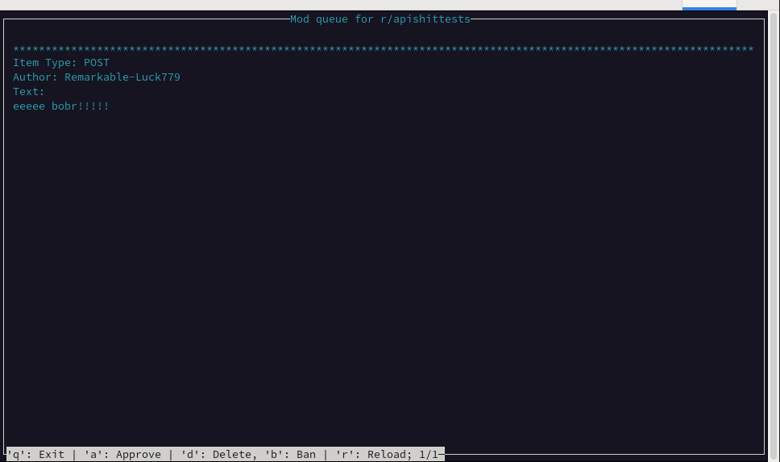

**Redditmoddingsucks**

Cause it really sucks to moderate a subreddit, especially a big one where the mod queue grows to 4 pages every 30 minutes. And it's even worse on mobile, although there has been a slight improvement.

I'm aware of the upcoming "improvements" and I've tested them out. Yes, the jiggling is gone, which is good. But the UI still feels like a unicorn puked on your eyes. Hence the reason I got really fed up 3 hours ago and I came up with this.

There are a few reddit clients written in rust but they have been long abandoned. Praw is the next best thing: at least the documentation is there and everything is maintained and up to date.

Problem: seems none of the API's return the actual reports from the mod queue and even more annoyingly the actions performed by automod. Still - lightweight client that you can use over ssh or whatever.

UI/UX peaked at around 95 with ncurses and it's been a race to the bottom ever since.

